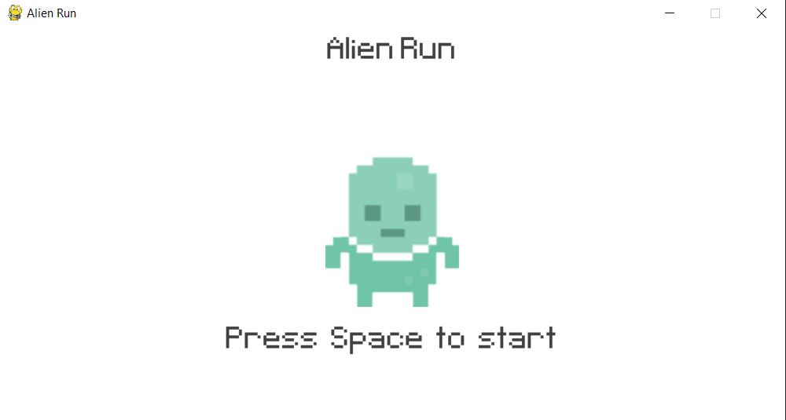
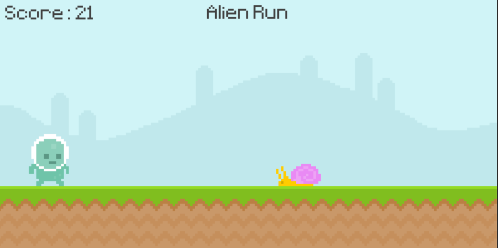
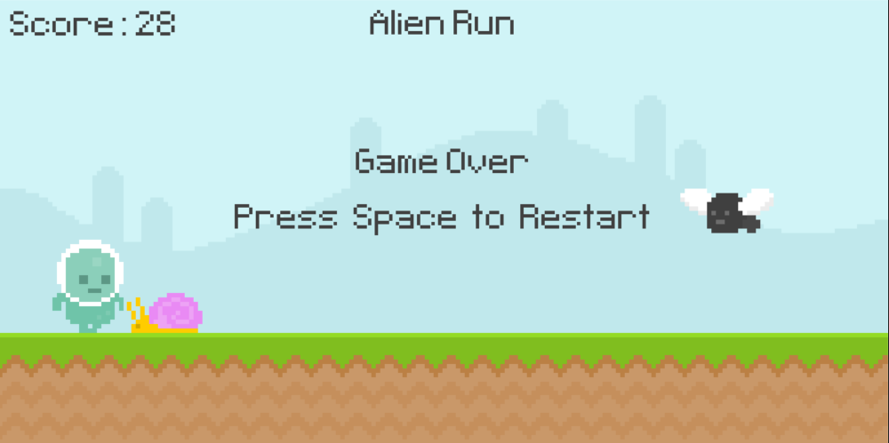

# Alien Run
> Welcome to the Alien Adventure Game! This game is a modified version of the classic Chrome dinosaur game, with a fun twist. Instead of controlling a dinosaur, you'll take control of a courageous alien on an exciting journey.

## Table of Contents
* [General Info](#general-information)
* [Technologies Used](#technologies-used)
* [Features](#features)
* [Screenshots](#screenshots)
* [Setup](#setup)
* [Usage](#usage)
* [Project Status](#project-status)
* [Room for Improvement](#room-for-improvement)
* [Acknowledgements](#acknowledgements)
* [Contact](#contact)
<!-- * [License](#license) -->

## General Information
This project aims to provide an entertaining and engaging gaming experience for players. It showcases the developer's creativity by reimaging the original game with a science fiction theme.
<!-- You don't have to answer all the questions - just the ones relevant to your project. -->

## Technologies Used
Python: The primary programming language used to develop the game logic and mechanics.
Pygame: A popular Python library for creating games, providing functionalities for graphics, sound, and user input.

## Features
List the ready features here:
- Control an alien character through a landscape.
- Encounter snails as obstacles and make timely decisions to jump over
- Watch out for flying birds and navigate the alien to avoid colliding with them.
- Simple controls using space keys.
- Survive as long as possible to achieve high scores.
- You need python and pygame installed for this game to run.

## Screenshots

<!-- If you have screenshots you'd like to share, include them here. -->

## Setup

To play the Alien Adventure Game, follow these steps:

1. **Install Python:** Make sure Python is installed on your system. If not, you can download and install Python from the official website: [python.org](https://www.python.org/).

2. **Install Pygame:** Open your terminal or command prompt and run the following command to install the Pygame library:

3. **Download the Game:** Clone or download the game's source code from the [GitHub repository](https://github.com/AavashGyawali/Alien-Run.git).

4. **Run the Game:** Navigate to the project directory using the terminal or command prompt. Execute the `game.py` file by running the following command:

Make sure Python is installed on your system. If not, download and install Python from the official website: python.org.
Install the Pygame library by running the following command in your terminal or command prompt:

5. **Control the Alien:** Use the space keys on your keyboard to control the alien character. Press the **Space key** to jump over snails.

6. **Survive and Score:** Your objective is to survive for as long as possible while earning points and setting high scores. Avoid colliding with snails and birds to stay in the game and improve your score.

Enjoy playing the Alien Run Game and have a fantastic time navigating the alien through the desert obstacles with Python and Pygame!

## Usage
How does one go about using it?
Provide various use cases and code examples here.

`write-your-code-here`

## Project Status
Project is: _in progress_ / _complete_ / _no longer being worked on_. If you are no longer working on it, provide reasons why.

## Room for Improvement
Include areas you believe need improvement / could be improved. Also add TODOs for future development.

Room for improvement:
- Improvement to be done 1
- Improvement to be done 2

To do:
- Feature to be added 1
- Feature to be added 2

## Acknowledgements
Give credit here.
- This project was inspired by Clear Code
- This project was based on [this tutorial](https://www.youtube.com/watch?v=AY9MnQ4x3zk&t=11638s&ab_channel=ClearCodem).

## Contact
Created by [@AavashGyawali](https://aavashgyawali.com.np/) - feel free to contact me!

<!-- Optional -->
<!-- ## License -->
<!-- This project is open source and available under the [... License](). -->

<!-- You don't have to include all sections - just the one's relevant to your project -->